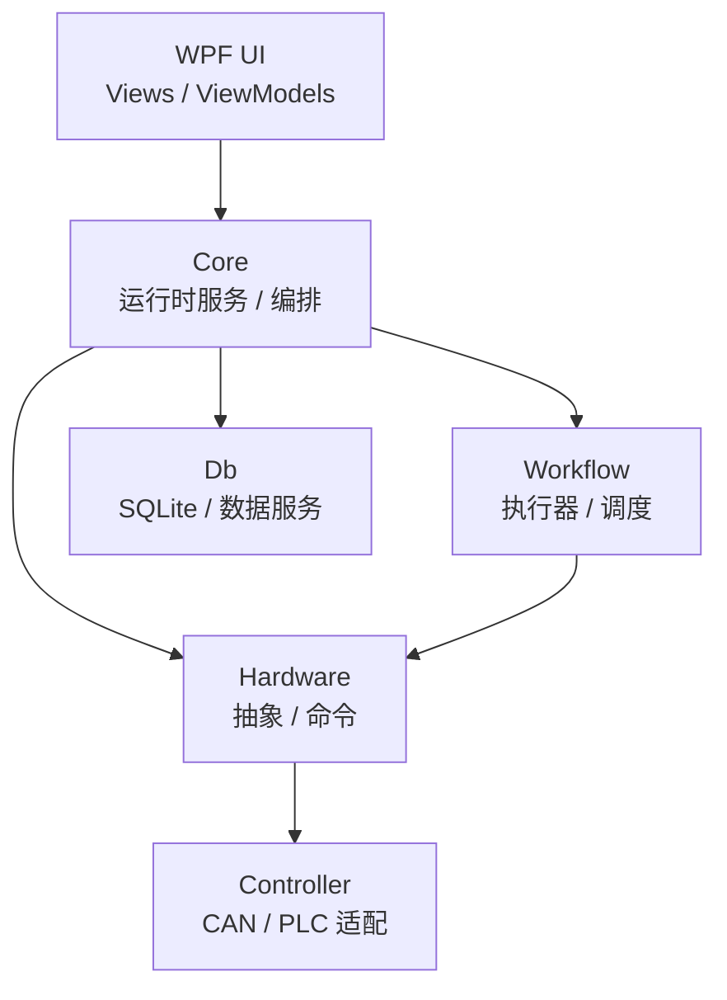

# HardwareModularWorkflow

HardwareModularWorkflow 是一个面向硬件设备的模块化工作流平台。它将硬件操作抽象为可复用步骤，并通过模块与工作流进行组合，支持串行、并行、嵌套引用、超时控制和执行结果记录。

当前以 WPF 桌面应用为入口，使用 SQLite 持久化硬件、控制器、模块、工作流与执行日志等数据。

## 主要能力

- 硬件抽象：统一描述电机、温控、制冷及自定义硬件。
- 命令执行：通过命令与驱动接口隔离具体设备通信实现。
- 模块编排：将多个硬件步骤组合为可复用模块。
- 工作流调度：将多个模块组合为工作流，支持串行或并行执行。
- 工作流嵌套：工作流可引用其他工作流并配置执行条件。
- 执行控制：支持超时、取消、失败策略与结果汇总。
- 控制器适配：提供 CAN/PLC 适配层，可接入厂商动态库。
- 桌面管理：提供仪表盘、硬件、控制器、模块、工作流、监控与日志视图。

## 技术栈

- .NET 10
- WPF
- C#（Nullable、Implicit Usings）
- SQLite / Entity Framework Core
- Microsoft.Extensions.DependencyInjection
- CommunityToolkit.Mvvm
- MahApps.Metro / MaterialDesign

## 解决方案结构

```text
HardwareModularWorkflow/
├── HardwareModularWorkflow.Core        核心服务、依赖注入、运行时编排
├── HardwareModularWorkflow.Hardware    硬件抽象、硬件模型、命令与执行结果
├── HardwareModularWorkflow.Workflow    工作流模型、执行器、调度器
├── HardwareModularWorkflow.Controller     CAN/PLC 控制器与厂商库适配
├── HardwareModularWorkflow.Db          数据库上下文、实体、数据服务
└── HardwareModularWorkflow.Wpf         WPF 应用、View、ViewModel
```

## 架构分层



## 核心概念

```text
Flow（工作流）
└── Module（模块）
    └── HardwareStep（硬件步骤）
        └── HardwareCommand（硬件命令）
```

- Hardware：设备与状态抽象。
- HardwareCommand：设备操作描述。
- Module：可复用执行单元，包含多个硬件步骤。
- Flow：由模块与子工作流引用组成的执行编排。

执行模式：

| 模式 | 说明 |
| --- | --- |
| Sequential | 上一步完成后执行下一步 |
| Parallel | 并行执行并等待结果 |

## 项目职责

### HardwareModularWorkflow.Core

负责依赖注入、服务注册、跨项目协调与运行时入口。

### HardwareModularWorkflow.Db

负责数据模型、数据库上下文、仓储/服务与初始化。

### HardwareModularWorkflow.Hardware

负责硬件抽象、命令模型、执行结果与驱动接口。

### HardwareModularWorkflow.Workflow

负责工作流模型、执行引擎、调度策略与取消/超时控制。

### HardwareModularWorkflow.Controller

负责 CAN/PLC 控制器适配、厂商动态库加载与通信实现。

### HardwareModularWorkflow.Wpf

负责桌面 UI、页面导航、ViewModel 交互与可视化监控。

## 运行方式

在仓库根目录执行：

```powershell
dotnet restore .\HardwareModularWorkflow\HardwareModularWorkflow.slnx
dotnet build .\HardwareModularWorkflow\HardwareModularWorkflow.slnx
dotnet run --project .\HardwareModularWorkflow\HardwareModularWorkflow.Wpf\HardwareModularWorkflow.Wpf.csproj
```

或在 Visual Studio 中打开 `HardwareModularWorkflow.slnx`，将 `HardwareModularWorkflow.Wpf` 设为启动项目后运行。

默认数据库文件位于应用工作目录（SQLite）。首次运行会执行必要初始化。

## 功能说明

- 硬件/模块/工作流配置管理（增删改查）
- 控制器通道配置（CAN/PLC）
- 工作流串行/并行执行与嵌套引用
- 取消、超时、失败策略控制
- 执行耗时与结果日志记录
- 面向真实设备与模拟环境的适配运行

## 当前状态

项目处于持续开发阶段。基础领域模型、执行框架和 WPF 管理界面已建立；具体硬件通信能力取决于目标设备、厂商 SDK 与运行环境配置。


